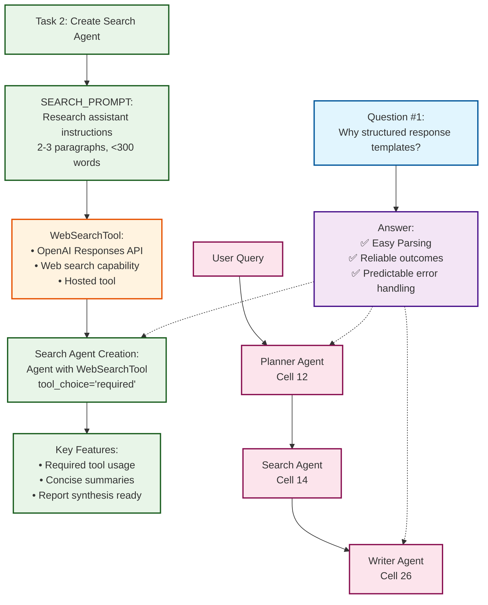

# Flowchart for Cells 13 and 14

## Visual Flowchart Diagram

## Cell 13: Question about Structured Responses

**Question #1:** "Why is it important to provide a structured response template? (Why are structured outputs helpful/preferred in Agentic workflows?)"

**Answer:**
- ✅ Easy Parsing (avoids random parsing)
- ✅ Better reliable outcomes
- ✅ Ease for error handling and predictable output template

## Cell 14: Search Agent Creation Flow

**Task 2: Create Search Agent**

1. **SEARCH_PROMPT**: Instructions for research assistant to create concise summaries
2. **WebSearchTool**: OpenAI's hosted tool for web searches
3. **Search Agent Creation**: Agent configured with required tool usage
4. **Key Features**: Ensures reliable tool usage and structured output

## Integration Flow: How Cells 13 & 14 Connect

The flowchart shows how Cell 13's structured output principles are applied throughout the agent workflow:

1. **Cell 13** establishes WHY structured outputs are important
2. **Cell 14** implements HOW to use structured outputs with tools
3. **Integration**: All agents (Planner, Search, Writer) benefit from structured outputs
4. **Flow**: User Query → Planner → Search Agent → Writer Agent

## Key Relationships

- **Cell 13** explains the theoretical benefits of structured outputs
- **Cell 14** demonstrates practical implementation with `tool_choice="required"`
- **Integration**: The Search Agent uses structured outputs to ensure reliable web search and summary generation
- **Workflow**: All agents in the chain benefit from structured, predictable outputs
